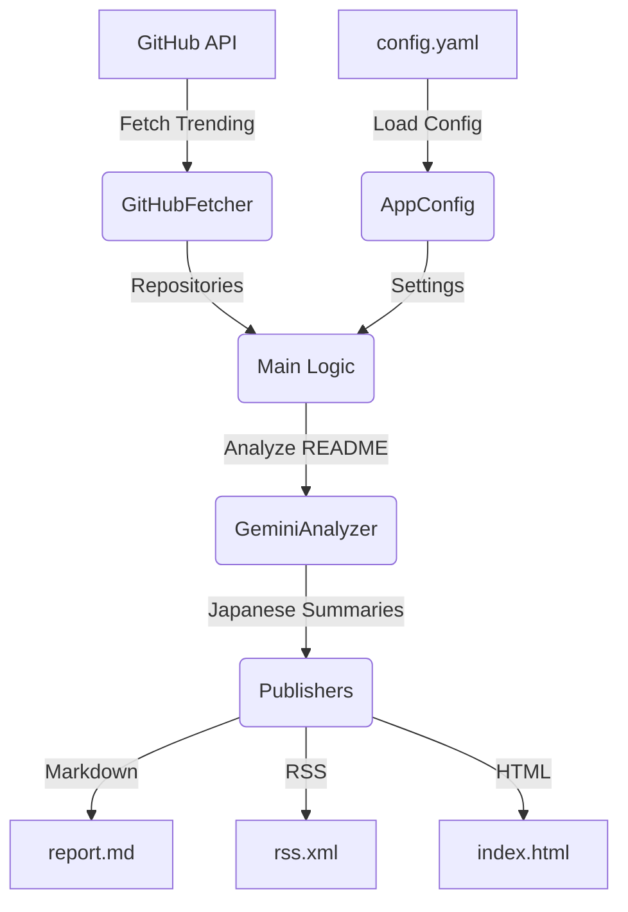

GitHubのトレンドリポジトリを自動で収集し、Gemini APIを用いて日本語で技術的な要約を生成するコマンドラインツールです。

## ライブレポート

このツールによって生成された最新のレポートは、以下からご確認いただけます：

- 🌐 [Webレポート (HTML)](https://sakebook.github.io/github-trend-summary/)
- 📡 [RSSフィード](https://sakebook.github.io/github-trend-summary/rss.xml)

## システムアーキテクチャ



## 主な機能

- **Rising Stars 抽出**: 過去14日以内の新着リポジトリに特化し、かつスター数が多すぎる「有名すぎる」プロジェクトを除外する、独自のトレンド抽出ロジック（Rising Stars）。
- **既読スキップ (Seen Skip)**: 前回のレポート（公開済みRSS）を参照し、一度紹介したリポジトリは一定期間（14日間）紹介を控えることで、毎日新しい発見を提供。
- **AI要約**: Google Gemini APIを使用して、リポジトリの内容を日本語で分かりやすく要約。
- **マルチフォーマット出力**: Markdown, RSS, 精細なダークモード対応 HTML (Glassmorphism) 形式での出力に対応。
- **自動実行**: GitHub Actionsによる定期的なレポート生成。

## ローカルでの実行方法

### 準備

1.  [Gemini API Key](https://aistudio.google.com/app/apikey) を取得します。
2.  (任意) GitHub APIのレート制限を回避するため、Personal Access Tokenを取得します。
3.  (任意) `config.yaml` を編集して、監視したいトピックやプログラミング言語を設定します。

### 実行

```bash
dart pub get

# config.yamlの設定を使用する場合（推奨）
dart bin/main.dart \
  --gemini-key YOUR_GEMINI_KEY \
  --github-token YOUR_GITHUB_TOKEN \
  --output report.md \
  --rss public/rss.xml \
  --html public/index.html

# CLI引数で設定を上書きする場合
dart bin/main.dart \
  --lang all \
  --topic ai,llm,mcp,rag,agents \
  --new-only \
  --gemini-key YOUR_GEMINI_KEY \
  --github-token YOUR_GITHUB_TOKEN \
  --output report.md \
  --rss public/rss.xml \
  --html public/index.html
```

## 設定ファイル

プロジェクトルートの `config.yaml` で以下の設定が可能です：

- **languages**: 監視するプログラミング言語（例: `[all]`, `[dart, typescript]`）
- **topics**: 監視するトピック（例: `[ai, llm, mcp]`）
- **minStars**: スター数の最小値（デフォルト: 50）
- **maxStars**: スター数の最大値（オプション）
- **newOnly**: 過去14日以内のリポジトリのみを対象とするか（デフォルト: true）
- **geminiModel**: 使用するGeminiモデル（デフォルト: gemini-3-flash-preview）
- **excludeRepos**: 除外するリポジトリのリスト（例: `["owner/repo"]`）

## 主要なコマンドラインオプション

| オプション | 説明 |
| :--- | :--- |
| `--lang` | 対象とするプログラミング言語 (カンマ区切り。`all` で全言語) |
| `--topic` | 対象とするトピック (カンマ区切り。`ai, mcp` 等) |
| `--new-only` | 過去14日以内に作成されたリポジトリのみを対象とする (Rising Stars モード) |
| `--gemini-key` | Google Gemini API キー (必須) |

## GitHub Actions ワークフロー

このプロジェクトは現在、単一の統合されたワークフローで運用されています：

- **Trending Intelligence (`trending_report.yml`)**:
    - **インテリジェンス生成**: 毎日実行され、幅広い言語とAI関連トピックのレポートを生成します。
    - **永続化**: 公開済みの `rss.xml` を自動的に「記憶」として読み込むことで、14日間にわたる内容の重複を回避します。
    - **公開**: 生成されたレポートは GitHub Actions のアーティファクトとして保存されるほか、GitHub Pages にも自動デプロイされます。
